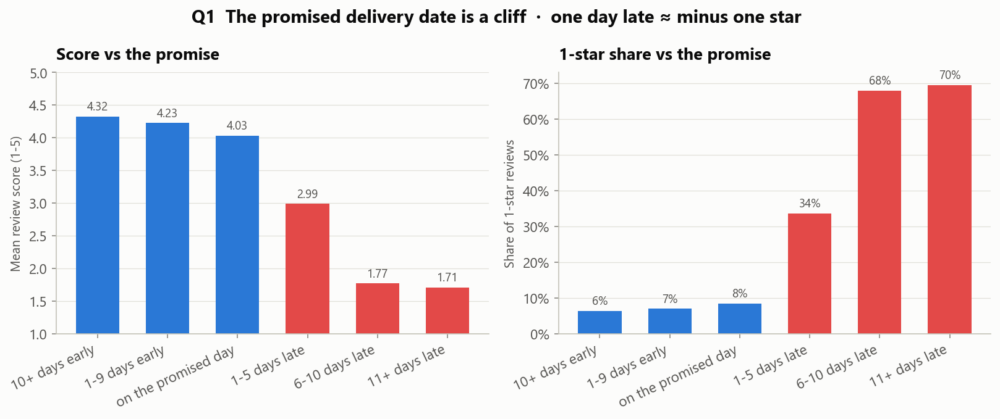
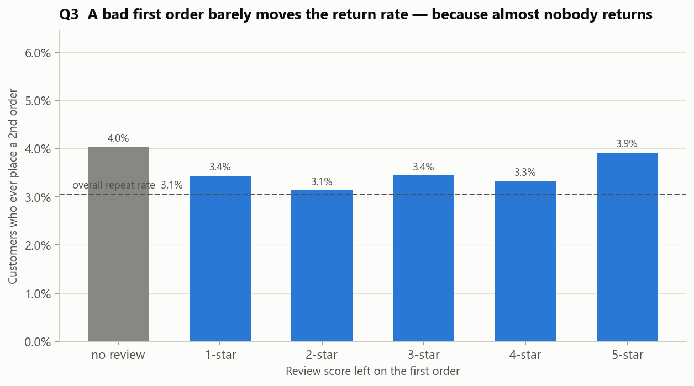
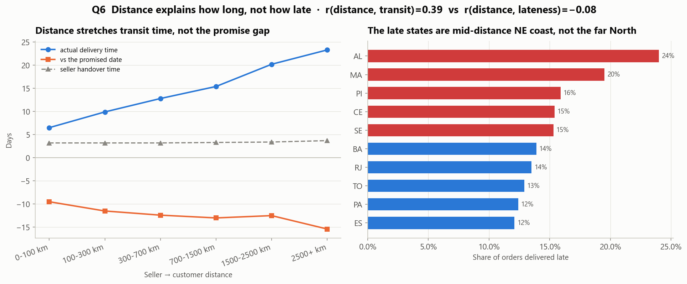

# Olist e-commerce: qué mueve las reseñas y cuánto cuesta

Análisis **SQL-first** del [dataset de Olist](https://www.kaggle.com/datasets/olistbr/brazilian-ecommerce)
(marketplace brasileño): 9 tablas relacionales, ~100.000 pedidos, de septiembre 2016 a
octubre 2018. Cada pedido lleva una reseña de 1 a 5 estrellas. Este proyecto responde
**qué determina esa nota, cuánto le cuesta al negocio, y qué debería hacer distinto la
plataforma.**

**Stack.** El motor es [DuckDB](https://duckdb.org) (una base de datos analítica que
corre dentro de un archivo, sin servidor). Todo el trabajo con datos son consultas SQL
comentadas en [`sql/`](sql/) — nada escondido dentro de pandas. Python ([`src/`](src/))
sólo carga los CSV, ejecuta los `.sql` y dibuja los gráficos. La narrativa completa está
en [`notebooks/olist_analysis.ipynb`](notebooks/olist_analysis.ipynb).

---

## Los tres hallazgos principales

### 1. La fecha de entrega prometida es un precipicio, no una pendiente



El tiempo de entrega y la nota están correlacionados en general (Pearson *r* = **−0,33**;
unos −0,3 puntos de reseña por cada semana extra en tránsito). Pero el promedio esconde
un **umbral que cae justo sobre la fecha de entrega que se le prometió al cliente al
comprar.** Los pedidos que llegan antes o en fecha promedian ~4,0–4,3 estrellas. Los que
llegan **1 a 5 días tarde promedian 2,99**; los que llegan **6 a 10 días tarde promedian
1,77**, y el 68% de esos son de 1 estrella. Llegar *muy* antes casi no suma: adelantarse
10+ días da 4,32 contra 4,03 por llegar el día exacto.

**Decisión:** tratar "este pedido va a incumplir su fecha prometida" como una alarma
operativa de máxima prioridad — intervenir o compensar de forma preventiva *antes* de que
pase la fecha, no después de que caiga la reseña de 1 estrella. No gastar en recortar
días a pedidos que ya llegan en fecha.

### 2. Es un marketplace de una sola compra — y una mala primera experiencia casi no cambia eso



**El 3,1% de los clientes hace un segundo pedido alguna vez.** Si se parte la tasa de
recompra según la nota que dejaron en su primer pedido, es prácticamente plana: los que
pusieron **1 estrella vuelven en un 3,4%, los de 5 estrellas en un 3,9%**. Una primera
entrega arruinada genera una mala reseña, pero no se puede demostrar que cueste un
cliente futuro — porque casi no hay recompra que perder.

**Decisión:** justificar toda la inversión en calidad de entrega por la **economía del
primer pedido** — nota de reseña, posición en el buscador, reputación de la plataforma —
y no por valor de vida del cliente (LTV) ni por un programa de fidelización, que acá
casi no tendría con qué trabajar.

### 3. La distancia determina cuánto *tarda* la entrega, no cuán *tarde* llega



La distancia vendedor↔cliente predice fuerte el **tiempo de tránsito** (*r* = **0,39**,
unos 6 días por cada 1.000 km) pero **no el atraso contra la promesa** (*r* = **−0,08**).
La fecha estimada de Olist ya escala con la distancia — la ventana prometida va de ~20
días para São Paulo a 40–47 días para los estados del Amazonas, y esos clientes lejanos
después le ganan a la estimación por 17–20 días. El **tiempo que tarda el vendedor en
despachar** predice el incumplimiento ~2,5× mejor que la distancia. Los estados con más
retrasos reales son los de la **costa nordeste, a distancia media** — Alagoas 24% tarde,
Maranhão 20% — donde la ventana prometida quedó demasiado ajustada para la variación
real.

**Decisión:** la distancia no es la palanca. Hacer cumplir los plazos de despacho de los
vendedores, y ampliar la ventana prometida para AL / MA / PI / CE / SE unos 5–7 días (o
arreglar esas rutas de transporte). Un depósito regional para el norte lejano se gastaría
en clientes que ya están contentos.

> **Mención (Q4):** 824 vendedores — el 27% del padrón, el 13% de la facturación —
> despachan tarde el 39% de las veces y promedian una reseña de 2,96. Son un pasivo
> reputacional muy por encima de lo que aportan en ingresos.

---

## El dataset y lo sucio que está

Toda la limpieza vive en un solo lugar — [`sql/00_staging.sql`](sql/00_staging.sql) — que
construye vistas `stg_*` que todas las consultas de análisis leen. Qué se encontró y qué
se decidió:

| Problema | Tamaño | Decisión |
|---|---|---|
| `order_reviews` tiene filas duplicadas por pedido; `review_id` no es único | 547 pedidos con >1 reseña; `review_id` repetido en 789 filas | quedarse con una fila por pedido — la más reciente por `review_answer_timestamp`, y después por `review_creation_date` |
| Pedidos con estado `delivered` pero sin fecha de entrega | 8 | excluidos del análisis de entrega con un flag `is_clean_delivered` |
| Fecha de entrega anterior a la fecha de compra | 0 en esta versión | el flag queda en staging para que un refresco de datos no lo reintroduzca en silencio |
| `order_approved_at` faltante | 160 | no se usa como filtro |
| Pedidos sin ninguna reseña | 768 (0,8%) | excluidos del análisis de notas; el sesgo de no-respuesta se chequea en Q3 (vuelven al 4,0%, igual que el resto) |
| Nombres de categoría en portugués | tabla de traducción de 71 filas; 2 categorías no están en ella; 610 productos sin categoría | traducidos en staging; lo que no matchea → `unknown` (1.603 ítems de pedido, ~1,4%) |
| `geolocation` tiene muchos puntos GPS por prefijo postal, algunos fuera del continente | 42 filas fuera del recuadro de Brasil | colapsar a la **mediana** de lat/long por prefijo, sólo dentro de Brasil |
| Prefijo postal de cliente/vendedor ausente en `geolocation` | 279 clientes, 7 vendedores | descartados sólo del análisis de distancia (Q6), ~0,3% |
| 2016 es un piloto | sept 2016: 2 pedidos · oct: 290 · dic: 1 | marcados `is_partial_month`; excluidos de la tendencia en Q5 |

Base utilizable para las preguntas de entrega: **96.470 pedidos entregados limpios**,
**95.824** de ellos con reseña.

---

## Las seis preguntas

Cada una es un archivo `.sql` comentado (o un grupo chico de ellos) más un gráfico y una
decisión. El desarrollo completo está en el [notebook](notebooks/olist_analysis.ipynb).

| # | Pregunta | Número principal | Decisión |
|---|---|---|---|
| **1** | ¿El tiempo de entrega predice la nota? ¿Lineal o umbral? — [`01_*`](sql/) | *r* = −0,33; en fecha ≈ 4,2★, 6–10 días tarde ≈ 1,8★. Un **umbral en la fecha prometida**, no una pendiente. | Disparar la intervención *antes* de incumplir la fecha; dejar de optimizar los pedidos que ya llegan bien. |
| **2** | Peores categorías contra su estimación de entrega, y el costo en reseñas — [`02_category_delivery_performance.sql`](sql/02_category_delivery_performance.sql) | Todas las categorías le ganan a su estimación en promedio; la **cola** de atrasos es 4–13%. `audio` 12,8% tarde; llegar tarde cuesta 1,2–2,1★ dentro de una categoría. Más daño *total*: salud/belleza, cama/baño (volumen). | Arreglar las rutas de `audio`/`electronics`; atacar la *tasa* de atraso en las categorías de volumen. |
| **3** | ¿Qué fracción compra dos veces? ¿Una mala primera compra predice el abandono? — [`03_repeat_customers*.sql`](sql/) | **3,1%** recompra alguna vez. Tasa de recompra por primera reseña: 1★ → 3,4%, 5★ → 3,9% (plana). | Construir el caso de calidad de entrega sobre la reputación del primer pedido, no sobre LTV/retención. |
| **4** | Segmentar vendedores por volumen, fiabilidad y reseñas — [`04_seller_segmentation.sql`](sql/04_seller_segmentation.sql) | Núcleo: 233 vendedores / 37% facturación / 3% tarde. **En riesgo: 824 vendedores / 13% facturación / 39% tarde / 2,96★.** Los "En ascenso" (1.411) despachan *mejor* que el Núcleo. | Poner en probación o dar de baja a los 824 en riesgo; hacer crecer a los "En ascenso" en vez de exprimir al Núcleo. |
| **5** | Estacionalidad de ingresos y pedidos, tendencia, anomalías — [`05_revenue_seasonality.sql`](sql/05_revenue_seasonality.sql) | ~8× de crecimiento durante 2017, después **plano todo 2018** (bajando en el segundo semestre). El ticket promedio nunca se movió (~R$160). Única anomalía: Black Friday 2017 (+11σ en un día). | El crecimiento es un problema de adquisición, no una caída estacional — necesita su propio diagnóstico. |
| **6** | ¿La distancia explica los retrasos de entrega? — [`06_geo_*.sql`](sql/) | *r*(distancia, tránsito) = 0,39; *r*(distancia, atraso) = −0,08. El tiempo de despacho predice mejor el atraso. Estados con retrasos = costa nordeste (AL 24%). | Hacer cumplir los plazos de despacho; ampliar la ventana prometida para AL/MA/PI/CE/SE. |

---

## Limitaciones

- **Correlación, no causalidad.** Una entrega tardía coincide con productos dañados,
  regiones remotas, vendedores mal calificados y fletes baratos. El −0,33 de la Q1 es una
  asociación; el efecto causal de un día de demora no queda identificado acá.
- **Los datos terminan en octubre de 2018.** La meseta de crecimiento de 2018 (Q5) y la
  tasa de recompra del 3,1% (Q3) son en parte un efecto de censura por fin de ventana. La
  Q3 usa una ventana de 120 días para atenuarlo, no para eliminarlo.
- **Muestras chicas.** La Q2 descarta categorías con menos de 200 pedidos, pero varias de
  las que quedan (`audio` 345, `drinks` 287) siguen con márgenes de error amplios en el
  corte en fecha / tarde. Los estados del norte lejano en la Q6 tienen entre 40 y 240
  pedidos cada uno.
- **"Olist" no es una marca de cara al consumidor** — vende a través de muchas tiendas,
  así que un cliente puede no percibir sus compras repetidas como repetidas, lo que
  deprime la Q3.
- **Un país, una plataforma, dos años.** Nada de esto generaliza.

---

## Cómo reproducirlo

Windows (PowerShell). Python 3.10+.

```powershell
python -m venv .venv; .venv\Scripts\Activate.ps1
pip install -r requirements.txt

# traer los datos (~45 MB) a data/raw/ :
#   API de Kaggle:  python scripts/download_data.py     (necesita ~/.kaggle/kaggle.json)
#   o a mano:       descargar de la página del dataset en Kaggle, descomprimir en data/raw/
python scripts/download_data.py

python run_all.py
```

`run_all.py` construye la base DuckDB desde los CSV, ejecuta cada consulta de
[`sql/`](sql/), regenera cada gráfico en [`figures/`](figures/), y ejecuta el notebook de
punta a punta. `data/` y el `*.duckdb` generado están en el `.gitignore`.

---

## Estructura del repositorio

```
sql/          consultas numeradas y comentadas — un análisis cada una, 00_staging.sql primero
src/          config (rutas + paleta) · db (CSV → DuckDB) · queries (ejecuta un .sql → DataFrame) · plots
notebooks/    olist_analysis.ipynb — la narrativa: calidad de datos → 6 preguntas → limitaciones
scripts/      download_data.py
figures/      gráficos, regenerados por run_all.py, incrustados arriba
data/          en .gitignore — los CSV crudos van en data/raw/
GUIA.md       explicación desde cero de todo el proyecto
```


